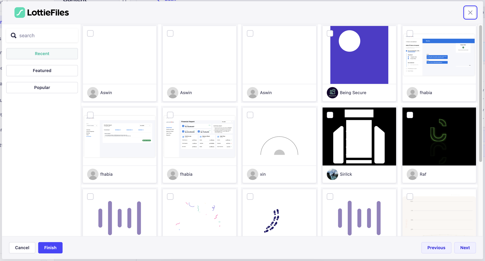
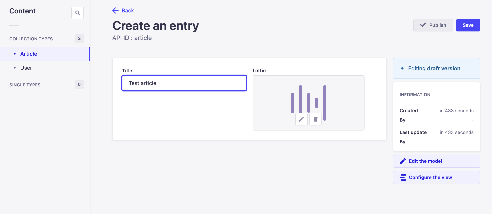

<div align="center" width="100%">
    <svg xmlns="http://www.w3.org/2000/svg" fill="none" height="36" viewBox="0 0 1025 200" width="170"><g fill="#000"><path d="m802.169 70.4766h-24.274v85.3194h24.274z"></path><path d="m802.169 42.3572h-24.274v18.8652h24.274z"></path><path d="m272.763 42.3572h-25.373v113.4388h77.478v-21.749h-52.105z"></path><path d="m375.011 63.3777c-27.007 0-48.385 20.8423-48.385 47.1083s21.378 47.163 48.385 47.163 48.564-20.843 48.564-47.122c0-26.2796-21.392-47.1493-48.564-47.1493zm0 71.7533c-13.593 0-23.739-10.325-23.739-24.714 0-14.3891 10.146-24.6318 23.739-24.6318s23.739 10.5035 23.739 24.6318c0 14.128-10.146 24.714-23.739 24.714z"></path><path d="m525.384 136.587c-4.353 0-8.156-2.54-8.156-10.325v-36.2338h23.149v-19.5517h-23.149v-24.5906h-24.275v24.5906h-31.881v-24.5906h-24.275v24.5906h-13.222v19.5517h13.222v36.5908c0 20.472 9.79 30.989 27.9 30.989 8.177.016 16.179-2.371 23.011-6.865l-6.865-17.932c-3.437 2.324-7.456 3.641-11.602 3.804-4.353 0-8.156-2.541-8.156-10.326v-36.2608h31.882v36.5908c0 20.472 9.775 30.989 27.899 30.989 8.177.014 16.179-2.374 23.012-6.865l-6.865-17.932c-3.446 2.323-7.476 3.631-11.629 3.776z"></path><path d="m678.859 104.102c-3.707-25.4699-25.909-43.4838-50.307-39.9277-6.136.8376-12.043 2.8919-17.374 6.0425s-9.981 7.334-13.674 12.3048c-3.693 4.9709-6.357 10.6292-7.834 16.6431-1.478 6.0143-1.74 12.2623-.771 18.3783 4.298 29.589 29.739 43.291 55.909 39.474 11.852-1.666 22.953-6.779 31.923-14.704l-11.479-15.914c-6.552 5.663-14.599 9.315-23.176 10.518-11.835 1.716-22.916-2.747-27.584-14.664l65.081-9.474c-.077-2.903-.316-5.8-.714-8.677zm-67.058 2.238c.686-11.6299 8.567-20.4721 18.961-21.9687 5.281-.8212 10.681.3111 15.187 3.1848 4.506 2.8736 7.811 7.2916 9.294 12.4264z"></path><path d="m942.381 104.102c-3.707-25.4699-25.922-43.4838-50.307-39.9277-6.136.8358-12.045 2.889-17.377 6.0391-5.332 3.15-9.982 7.3334-13.675 12.3047-3.694 4.9713-6.357 10.6304-7.834 16.645-1.477 6.0149-1.738 12.2639-.767 18.3799 4.298 29.589 29.726 43.291 55.909 39.474 11.849-1.666 22.945-6.78 31.909-14.704l-11.464-15.914c-6.557 5.664-14.61 9.316-23.191 10.518-11.835 1.716-22.915-2.747-27.583-14.664l65.094-9.474c-.085-2.903-.324-5.8-.714-8.677zm-67.058 2.238c.687-11.6299 8.554-20.4721 18.962-21.9687 5.274-.825 10.669.3066 15.168 3.1818 4.498 2.8752 7.791 7.2957 9.258 12.4294z"></path><path d="m842.028 42.3572h-24.275v113.4248h24.275z"></path><path d="m992.648 99.0759c-8.334-1.8124-15.941-3.4463-15.941-8.5127 0-3.8033 5.258-6.3434 10.874-6.3434 8.771.1392 17.389 2.3105 25.179 6.3434l8.16-18.1238c-10.13-6.1976-21.837-9.3437-33.71-9.0619-17.025 0-35.149 9.7895-35.149 28.2703 0 17.3962 14.678 23.3412 32.623 28.0782 7.785 2.183 15.586 3.446 15.586 8.883s-9.243 7.607-14.872 7.607c-10.253.2-20.252-3.201-28.257-9.611l-8.704 18.686c5.08 4.71 17.574 12.358 36.961 12.358 16.862 0 39.502-7.428 39.502-29.726 0-18.522-16.79-25.195-32.252-28.8471z"></path><path d="m577.915 70.4766h-24.275v85.3194h24.275z"></path><path d="m577.915 42.3572h-24.275v18.8652h24.275z"></path><path d="m689.198 155.796h25.318v-46.353h42.934v-21.5155h-42.934v-23.8629h52.161v-21.7074h-77.479z"></path></g><path d="m149.37 0h-98.7743c-27.9432 0-50.5957 22.6524-50.5957 50.5956v98.7744c0 27.943 22.6525 50.596 50.5957 50.596h98.7743c27.943 0 50.596-22.653 50.596-50.596v-98.7744c0-27.9432-22.653-50.5956-50.596-50.5956z" fill="#00ddb3"></path><path d="m151.979 44.7872c-34.422 0-47.177 24.577-57.4335 44.3209l-6.7002 12.6319c-10.8605 20.938-18.9747 33.666-39.8857 33.666-1.2982 0-2.5838.256-3.7832.753-1.1994.496-2.2893 1.225-3.2073 2.143-.9179.918-1.6465 2.007-2.1433 3.207-.4968 1.199-.7522 2.485-.7522 3.783.0036 2.621 1.0464 5.133 2.8996 6.986 1.8531 1.853 4.3656 2.896 6.9864 2.9 34.4351 0 47.1902-24.577 57.4464-44.321l6.687-12.6321c10.874-20.9385 18.988-33.6662 39.886-33.6662 1.299.0018 2.586-.2527 3.787-.7486 1.201-.496 2.292-1.2239 3.212-2.142.919-.9182 1.649-2.0086 2.147-3.2089.497-1.2003.753-2.4869.753-3.7863-.004-2.6231-1.048-5.1375-2.904-6.991-1.856-1.8536-4.372-2.8947-6.995-2.8947z" fill="#fff"></path></svg>
 
# LottieFiles plugin for Strapi

</div>

A plugin for [Strapi CMS](https://strapi.io), that allows creating a custom input field for adding lottie animations seamlessly via [LottieFiles](https://lottiefiles.com/recent) public animation repository.


## Table of contents

- ✨ [Features](##-features)
- ⏳ [Installation](##-installation) 
- 🔧 [Configuration](##-configuration)
- 👨‍💻 [Usage](##-usage)
- 🕸️ [API](##-api)


---
## ✨ `features`

- Custom field creation in Strapi models
- Browse LottieFiles public animation repository based on:
    - [Recent animations](https://lottiefiles.com/recent)
    - [Popular animations](https://lottiefiles.com/popular)
    - [Featured animations](https://lottiefiles.com/featured)
- Keywork based search 
- Animation metadata, with creator info
---
## ⏳ `installation`

At the root of your Strapi project, run the following commands to add the plugin

```
npm install strapi-plugin-lottie
# or
yarn add strapi-plugin-lottie
```

Start your Strapi application with in development mode

```
npm run develop
# or
yarn develop
```
---
## 🔧 `Configuration`

To start using the plugin, enable the plugin in strapi configuration.

```
./config/plugins.ts

export default {
    // ...
    "strapi-plugin-lottie": {
        enabled: true
    },
    // ...
}
```
---
## 👨‍💻 `usage`

Goto `Content-Type Builder` and create a new collection type. In the field selection dialogue, navigate to `custom` tab. Select `Lottie` field 

<div style="margin: 20px 0" align="center">
  
</div>

Give the new field a name and confirm. The new field should be visible in the collection's field list, with type: `Custom field` 

<div style="margin: 20px 0" align="center">
  
</div>


Goto `Content Manager`, select the collection type that was created. Click the `Create new entry`

<div style="margin: 20px 0" align="center">
  
</div>


Click the `Lottie Field`, to open the animation browser modal.

<div style="margin: 20px 0" align="center">
  
</div>

Once selected, the animation preview can be seen in the Lottie field as well as collection list view after saving the entry

<div style="margin: 20px 0" align="center">
    
  
</div>

---
## 🕸️ `api`

Lottie field data can be consumed via both RESP and GraphQL APIs provided by Strapi CMS.

### REST API

<div style="margin: 20px 0" align="center">
     
</div>

### GraphQL API

<div style="margin: 20px 0" align="center">
     
</div>

In both apis, the returned field data has the following structure

```
{
    "bgColor": "#fff",
    "gifUrl": "https://assets1.lottiefiles.com/render/lhu59gtz.gif",
    "imageUrl": "https://assets3.lottiefiles.com/render/lhu59gtz.png",
    "lottieUrl": "https://assets9.lottiefiles.com/dotlotties/dlf10_rrHcSPZWAB.lottie",
    "name": "Wave Form",
    "createdBy": {
      "avatarUrl": "https://lh3.googleusercontent.com/a/AGNmyxburVBP66UgfPD1D-I7l1wIwJmc1vVKOiGHXfrM=s96-c",
      "firstName": "Juan"
    }
  }
```